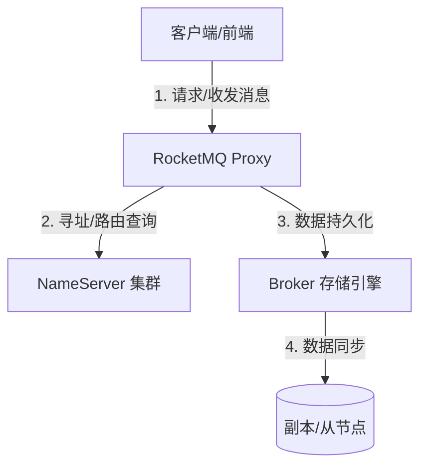

# [模块名称] 文档总览

## 1. 模块/功能定位
> [!IMPORTANT]
> 简要描述该模块解决的业务核心问题和技术定位。
> *参考 (RocketMQ 5.0)*: Apache RocketMQ 是一款低延迟、高并发、高可用、高可靠的分布式消息中间件，致力于构建超强弹性的 AI-Native 异步通信引擎。

## 2. 核心架构与时序
可以使用以下 Mermaid 关系图来体现系统层面的模块间交互：

## 3. 文档地图与阅读路径
*   **一、入门指南**
    *   [01_快速接入](./快速开始/01_快速接入.md) - 开发与测试环境搭建
    *   [02_调试与验证](./快速开始/02_调试与验证.md) - 日志与测试用例验证
*   **二、核心概念与建模**
    *   [01_领域模型与基本概念](./领域模型/01_领域模型与基本概念.md) - 核心实体 ER 关系与基本术语表
    *   [02_[概念实体名称]](./领域模型/02_[概念实体名称].md) - 单实体的定义与四步规范
*   **三、功能规则与业务行为**
    *   [01_[功能点行为定义]](./功能行为/01_[功能点行为定义].md) - 核心业务校验与流程时序
    *   [02_[异常与重试策略]](./功能行为/02_[异常与重试策略].md) - 退避、死信与自愈逻辑
*   **四、开发指南与运维监控**
    *   [01_[缓存快照与并发设计]](./开发与运维/01_[缓存快照与并发设计].md) - 并发锁、缓存失效与一致性重建
    *   [02_可观测性与监控指标](./开发与运维/02_可观测性与监控指标.md) - Metrics、告警阈值及 Dashboard 规划
*   **五、规格参数说明**
    *   [01_数据库表结构与DDL](./参考规格/01_数据库表结构与DDL.md) - 建表语句与历史变动
    *   [02_API契约与错误码](./参考规格/02_API契约与错误码.md) - 接口输入输出与错误映射
