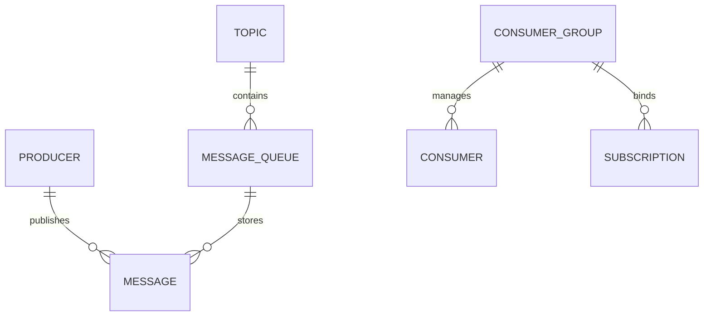

# 领域模型概述

本文介绍 [模块名称] 的领域模型分层及核心实体关系 (ERD)。

## 1. 实体关系图 (Entity Relationship Diagram)
使用 Mermaid 绘制出核心概念实体的上下游关联：

## 2. 领域边界与分层
[简要阐述领域的核心业务边界、限界上下文，以及与外部系统的解耦交互方式。]
- **核心域 (Core Domain)**: [描述核心实体，如 Message, Topic 等的职责。]
- **支撑域 (Supporting Domain)**: [如 Configuration, Route 等辅助功能。]
