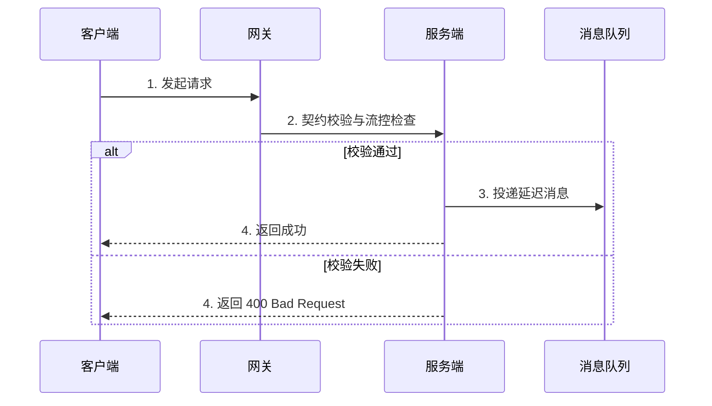

# [功能行为名称] 行为说明

## 1. 行为概述
[描述该功能行为触发的时机、处理的业务策略及对系统的影响。]

## 2. 交互时序与原理图
使用 Sequence 时序图描述核心系统组件或 API 的调用过程：


## 3. 关键规则约束
| 规则 ID | 规则名称 | 约束条件 | 行为说明 | 异常处理 |
| :--- | :--- | :--- | :--- | :--- |
| RULE_01 | [例如：频率拦截] | 60s 内请求超 100 次 | 触发滑窗流控，拒绝请求 | 返回 `429 Too Many Requests` |
| RULE_02 | [例如：黑名单匹配] | 属性匹配 IP 黑名单 | 若处于黑名单，静默丢弃 | 记录 Audit Log |

## 4. 接入代码示例 (以 Java SDK 为例)
```java
// 初始化服务并使用其核心接口
ClientServiceProvider provider = ClientServiceProvider.load();
Producer producer = provider.newProducerBuilder().setTopics(topic).build();
Message message = provider.newMessageBuilder()
    .setTopic(topic)
    .setKeys("order_123")
    .setBody("message payload".getBytes())
    .build();
SendReceipt sendReceipt = producer.send(message);
System.out.println("Send success: " + sendReceipt.getMessageId());
```
